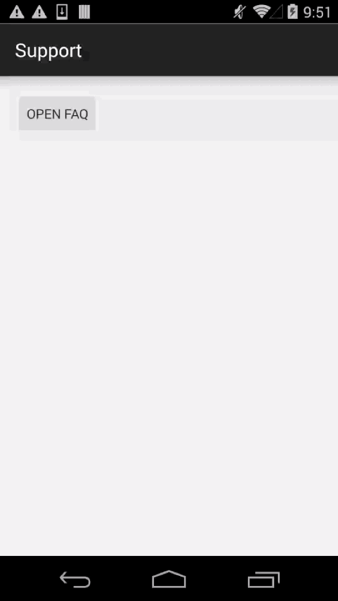

# MaxLeap-Demo-Support-Android

## Overview

Support is a sample of MaxLeap SDK. It relies on the basic module of MaxLeap and the HelpCenter Module. You can learn related operations of getting feedback with this app.


## Effect



## How to Use

1. Open Android Studio or IDEA, click `File -> Open `, select and import `setting.gradle`.
2. Open `App.java` and replace the defined constants with your own `APP Id` and `API KEY`.

## Configuration

### Show FAQ Page

```java
MLHelpCenter.openFaqs(context);
```

### Show Issue Page

```language
MLHelpCenter.openConversation(context);
```

### Push Settings

Once the app runs in foreground and there is new message in server, the app will show a popup to remind users. You can close this function by adding following code in `App.Java`：

```java
MLHelpCenter.allowAlertNewMessage(false)
```

### Get Unread Messages Amount

You can invoke following interface anywhere in the app to get unread messages amount. It will return `0` if there's none, `-1`  if there's network error.

```java
MLHelpCenter.getMessageCountInBackground(new CountCallback() {
    @Override
    public void done(int count, LCException e) {
		if (count > 0){
        	// do something
        }
    }
});
```
